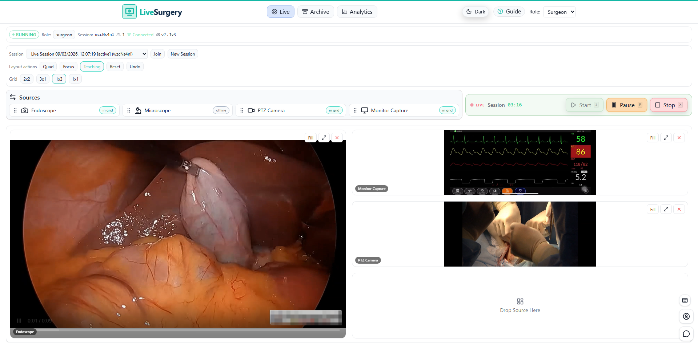

# LiveSurgery

<p align="center">
  
</p>

A **simulated Operating Room (OR) workspace** — a full-stack web application built as a
**Proof of Concept** demonstrating real-time multi-user collaboration, role-based access control,
and a multi-panel video workspace. Designed to evolve into an MVP with live WebRTC streaming.

> **Disclaimer:** This project is **not for clinical use** and does not store patient data.
> It is a portfolio/demonstration project.

---

## 30-second pitch

Medical procedures involve multiple video feeds (endoscope, microscope, PTZ camera, vitals monitor)
viewed simultaneously by surgeons, remote experts, and trainees. LiveSurgery provides a
**synchronized, multi-panel OR workspace** where roles control who can see and who can interact —
in real time. Today it runs on simulated video; the architecture is ready for WebRTC SFU integration.

---

## Deploy

**Platform:** Vercel (frontend) | Backend not yet deployed (local only)

**Live URL:** [https://livesurgery.vercel.app](https://livesurgery.vercel.app)

> The live demo runs the frontend only — layout sync and session persistence require
> running the backend locally (see setup below).

---

## Current status

**Stage:** PoC (Proof of Concept)
**Scope:** Full-stack simulated OR workspace — deployed frontend, local backend, no real video or auth
**Adoption:** Solo developer / portfolio project — not in clinical or production use

| Capability | Status |
|---|---|
| Multi-panel OR workspace UI (2×2, 3×1, 1×3, 1×1 modes) | Done |
| Drag-and-drop source assignment across panels | Done |
| Layout presets (Quad, Focus, Teaching) + undo history | Done |
| Role-based access (Surgeon / Admin / Viewer) | Done |
| Session CRUD (create, list, start, end) | Done |
| WebSocket real-time layout sync + presence | Done |
| Layout versioning + conflict resolution (optimistic concurrency) | Done |
| Simulated video assets (HTML5) | Done |
| Archive tab (mock data) | Done |
| Analytics dashboard (mock data, last 7 days) | Done |
| Dark / light theme | Done |
| Onboarding modal + keyboard shortcuts (S / P / X / I / C / ?) | Done |
| CI pipeline (lint, build, ruff, black, pytest) | Done |
| AI Production OS compliance (CLAUDE.md, weekly-sync, guardrails) | Done |

## What comes next (MVP targets)

- Real authentication (OIDC/JWT) replacing the dev-header scaffold
- WebRTC SFU for live video streaming
- Recording → archive storage (object storage)
- Deployed backend (currently frontend-only on Vercel)

---

## Tech stack

| Layer | Technology |
|---|---|
| Frontend | React 19, Vite 7, Tailwind CSS 3 |
| Drag-and-drop | @dnd-kit/core |
| Charts | Recharts |
| Backend | FastAPI (Python 3.13), Uvicorn |
| Persistence | SQLite (file-based, Postgres-ready) |
| Realtime | WebSocket (FastAPI + custom HMAC tokens) |
| CI | GitHub Actions |
| Frontend deploy | Vercel |

---

## Local setup

### Prerequisites

- Node.js 20+
- Python 3.13+

### Backend

```bash
cd backend
python -m venv venv
source venv/bin/activate      # macOS/Linux
# venv\Scripts\activate       # Windows

pip install -r requirements.txt
cp ../.env.example .env       # review and set WS_JWT_SECRET
python -m uvicorn app.main:app --reload --port 8000
```

Backend runs at: `http://localhost:8000`
API docs: `http://localhost:8000/docs`

### Frontend

```bash
cd frontend-react
npm install
npm run dev
```

Frontend runs at: `http://localhost:5173`

### Combined (scripts)

```bash
./scripts/dev.sh      # macOS/Linux
.\scripts\dev.ps1     # Windows PowerShell
```

---

## Quality checks

```bash
# Frontend
cd frontend-react
npm run lint
npm run build
npm run format:check

# Backend
cd backend
ruff check app tests
black --check app tests
pytest tests -q
```

---

## API quick reference

With the backend running at `http://localhost:8000`:

| Endpoint | Auth | Description |
|---|---|---|
| `GET /healthz` | none | Liveness + DB readiness |
| `POST /auth/token` | none | Mint a dev API token |
| `GET /v1/sessions` | Bearer | List sessions for current user |
| `POST /v1/sessions` | Bearer (Surgeon/Admin) | Create a session |
| `POST /v1/sessions/{id}/start` | Bearer (Surgeon/Admin) | Start a session |
| `POST /v1/sessions/{id}/end` | Bearer (Surgeon/Admin) | End a session |
| `POST /v1/sessions/{id}/participants:join` | Bearer | Join + get WS token |
| `GET /v1/sessions/{id}/layout` | Bearer | Get current layout |
| `POST /v1/sessions/{id}/layout` | Bearer (Surgeon/Admin) | Publish layout update |
| `WS /ws/sessions/{id}?token=<ws-token>` | WS token | Realtime layout + presence |
| `GET /docs` | none | Interactive OpenAPI UI |

### Get a token (curl)

```bash
curl -s -X POST http://localhost:8000/auth/token \
  -H "Content-Type: application/json" \
  -d '{"userId": "test-surgeon", "role": "SURGEON"}' | jq .
```

Valid roles: `SURGEON` | `OBSERVER` | `ADMIN`

See [docs/AUTH_MIGRATION.md](docs/AUTH_MIGRATION.md) for the full token flow and OIDC migration path.

---

## Project structure

```
/
├── backend/
│   ├── app/
│   │   ├── core/          # auth, database, errors
│   │   ├── routes/        # sessions, realtime (WebSocket), video
│   │   ├── services/      # realtime_hub, layouts, video_stream
│   │   ├── schemas/       # Pydantic request/response models
│   │   └── main.py
│   ├── tests/
│   └── requirements.txt
├── frontend-react/
│   ├── src/
│   │   ├── api/           # typed fetch client
│   │   ├── components/    # Navbar, Sidebar, DisplayGrid, SessionControls, ...
│   │   ├── data/          # mock data (archive, analytics)
│   │   └── theme/         # ThemeProvider context
│   └── public/videos/     # HTML5 video assets
├── docs/
│   ├── PRD.md
│   ├── ARCHITECTURE.md
│   ├── ROADMAP.md
│   ├── DECISIONS_LOG.md
│   ├── SPRINT_BACKLOG.md
│   ├── DAILY_CHECKLIST.md
│   ├── NEXT_SESSION_START.md
│   ├── WORKFLOW_AUTOMATION_PLAYBOOK.md
│   └── SPRINTS/           # sprint-01 through sprint-07
├── .github/
│   ├── workflows/ci.yml
│   ├── workflows/weekly-sync.yml
│   └── ISSUE_TEMPLATE/
├── .env.example
├── CHANGELOG.md
└── CONTRIBUTING.md
```

---

## Docs

| Document | Description |
|---|---|
| [Architecture](docs/ARCHITECTURE.md) | C4 diagrams, data model, realtime design |
| [PRD](docs/PRD.md) | Requirements, user journeys, success metrics |
| [Roadmap](docs/ROADMAP.md) | Weekly outcomes, milestones, freeze list |
| [Decisions Log](docs/DECISIONS_LOG.md) | ADR-style architectural decisions |
| [Sprint Backlog](docs/SPRINT_BACKLOG.md) | Active sprint with acceptance criteria |
| [Daily Checklist](docs/DAILY_CHECKLIST.md) | Pre/post-session quality checklist |
| [Next Session Start](docs/NEXT_SESSION_START.md) | Current state + "Start Here" guide |
| [Workflow Playbook](docs/WORKFLOW_AUTOMATION_PLAYBOOK.md) | GitHub Actions workflow docs |
| [Changelog](CHANGELOG.md) | What changed and when |
| [Contributing](CONTRIBUTING.md) | Local setup, PR process |

---

## Roadmap snapshot

| Phase | Outcome | Notes |
|---|---|---|
| NOW (PoC) | Full-stack simulated OR workspace | Deployed frontend, local backend |
| NEXT (MVP) | Real auth + WebRTC + deployed backend | Managed services, incremental |
| FUTURE | Compliance + enterprise readiness | Audit trails, SSO, multi-tenant |

See [docs/ROADMAP.md](docs/ROADMAP.md) for the detailed weekly delivery plan.
