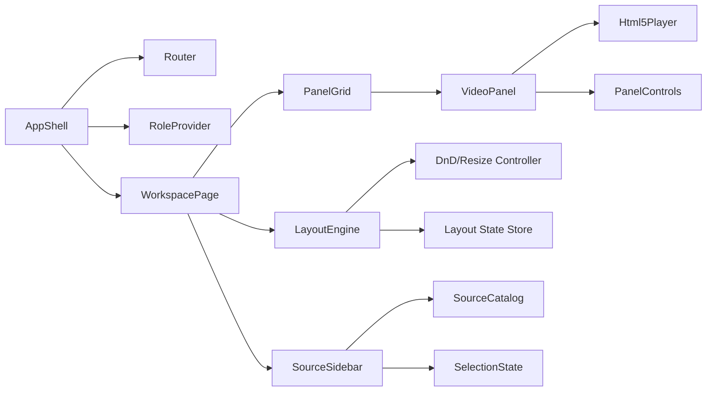

# LiveSurgery Architecture

This document describes:
- **NOW (PoC):** what exists today (frontend-only)
- **NEXT (MVP):** a production-realistic target architecture adding streaming + collaboration + auth + persistence
- **FUTURE:** evolution path for compliance/enterprise hardening

---

## Architecture principles
- **Transparency:** do not inflate PoC capabilities; label clearly
- **Incremental evolution:** reuse UI primitives; add backend/services stepwise
- **Operational simplicity:** optimized for solo developer MVP path
- **Security-first baseline:** least privilege, short-lived tokens, secure defaults
- **Production realism:** use proven patterns for realtime media (SFU) and identity (OIDC)

---

## Constraints
- **NOW (PoC):** Vercel SPA + HTML5 assets; no backend services
- **NEXT (MVP):** add backend + realtime + SFU without rewriting the UI
- **Domain-adjacent to MedTech:** design for “compliance-ready” posture, but **not clinical**

---

## System context (C4 L1) — MVP target

```mermaid
flowchart LR
  S[Surgeon] --> FE[LiveSurgery Web App]
  O[Observer] --> FE
  A[Admin] --> FE

  FE --> API[Session API]
  FE --> WS[Realtime Gateway]
  FE --> SFU[Media SFU]

  API --> DB[(Postgres)]
  API --> OBJ[(Object Storage)]
  API --> IDP[Identity Provider (OIDC)]

  SFU --> TURN[STUN/TURN]
  SFU --> REC[Recording Worker]
  REC --> OBJ
```

---

## Container view (C4 L2) — MVP target

**Recommended MVP shape:** Vercel-hosted frontend + managed DB/storage + managed SFU (then self-host later if needed).

```mermaid
flowchart TB
  subgraph Client
    B[Browser (React SPA)]
  end

  subgraph Edge
    V[Vercel (Static Hosting)]
  end

  subgraph Backend
    API[API Service (REST)]
    WS[Realtime Gateway (WebSocket)]
    DB[(Postgres)]
    OBJ[(S3-compatible Storage)]
    R[(Redis - optional)]
  end

  subgraph Media
    SFU[SFU]
    TURN[TURN/STUN]
    REC[Recording/Transcode Worker]
  end

  B --> V --> API
  B --> WS
  B --> SFU
  SFU --> TURN
  SFU --> REC --> OBJ
  API --> DB
  API --> OBJ
  WS --> API
  SFU --> R
```

---

## Frontend component view (C4 L3) — PoC core reused in MVP



---

## Realtime architecture (MVP)
### Media: WebRTC + SFU
- SFU forwards streams efficiently to many observers
- Clients publish/subscriber tracks; SFU handles routing
- TURN/STUN for NAT traversal; short-lived tokens for access

### Collaboration state: WebSocket
- Presence (who is in session)
- Shared session state (layout, selected sources, pointers/annotations)
- Server-authoritative updates with optimistic UI

---

## Key design decisions (ADR summary)

| ADR | Decision | Why |
|---|---|---|
| 001 | Frontend-only PoC | Speed + clear portfolio transparency |
| 002 | MVP auth + RBAC | Safe multi-user collaboration |
| 003 | SFU-based media | Scales to many observers with low latency |
| 004 | Recording to object storage | Cost-effective replay + retention policies |
| 005 | Staged deployment strategy | Minimize ops early; increase control later |

---

## Data model overview (MVP)
| Entity | Purpose |
|---|---|
| User | Identity + profile |
| Session | Live event container |
| Participant | User-in-session + role |
| Stream | SFU track references + metadata |
| Layout | Versioned layout JSON |
| ArchiveItem | Recording metadata + storage key |

---

## Sequence diagrams (MVP)

### Join session


### Start recording


---

## Deployment diagrams


